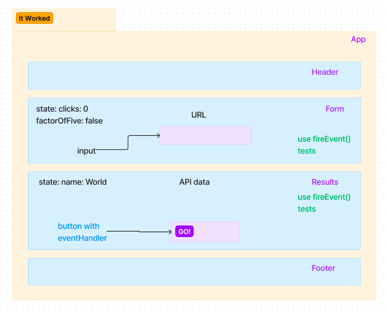

# RESTy

### Author
Camilla Rees

### Version
1.0.0

## Deployment

[Deployed Site]()

## Overview

The core requirements and functionality are as follows:

- Simple, intuitive user interface
    - A form where a user:
    - Enters a REST API Endpoint (URI)
    - Selects the REST Method to use (get, post, put, delete)
    - For put and post, allow the user to enter JSON to be used as the body for the request
    - A button to initiate the request

- An output section which:
    - Displays a spinner to indicate a request is in process
    - Once a request is complete:
        - Hide the spinner
        - Display a well formatted view of the API response in 2 sections
            - Headers
            - Body

- A history section which:
    - Shows a list of all unique, successful requests
    - Allows a user to click or select one to re-populate the form so they can repeat the request

### Phase 1

Basic scaffolding of a React App, with intent to build forward-thinking and add more functionality to the system as we go. The initial build sets up the file structure so that we can progressively build this application in a scalable manner.

### Phase 2

Taking in user input in preparation of connecting to live APIs, using the useState() hook in our functional components. 

This phase will allow the user to enter the REST Method and URL to an API, and see summary of their request as well as results returned from an API request in thier browser in a readable format

### Phase 3

Connecting RESTy to live APIs, fetching and displaying remote data. The primary focus will be to service GET requests.

The phase will allow the user to enter the URL to an API and issue a GET request so that they can retrieve it’s data, as well as see the results returned from an API request in their browser in a readable format.

## Credit and Collaborations
[401d49 Lab 28 Demo]()
[401d49 Lab 27 Demo]()
[401d49 Lab 26 Starter Code]()